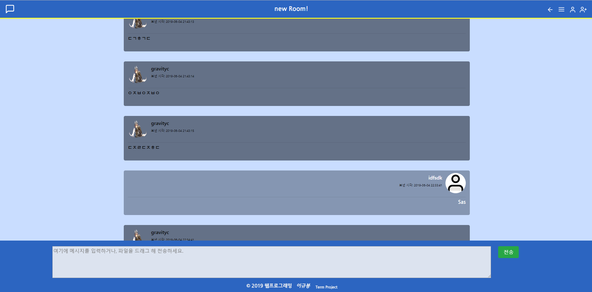

# Simple ChattingService (부트스트랩 4 를 이용한 반응형 채팅 웹 페이지)
2019 CNU Web Programming Term Project

# Development Environment
프론트엔 BootStrap 4.3.1, 백엔드엔 PHP, DB는 MySQL을 사용함.  
FileSaver : 파일 다운로드를 구현할 때, 사용한 파일 관리 JS 라이브러리.  
RequireJS : ReactJS 등에 사용되는 JS 종속성 관리 라이브러리.

# Asset Sources
svg 파일들은 오른쪽 페이지에서 다운로드 받아 사용했다. https://feathericons.com/

# Screen shots

</img>


# Part of Report  

1. #### 과제의 개요 

1) 본 과제의 주제  

: 주제는 채팅 웹 페이지 구현입니다. 보다 구체적으로는 데이터 베이스에 채팅 데이터를 저장하고 fetch 해 오는 식으
로 채팅 웹 페이지 및 관련 서비스를 구현하는 것 입니다.

2) 사용자 정보 저장  

: 제가 사용한 DB는 MySQL입니다. SignUp.html로 폼에 사용자 데이터가 입력되면 SignUpAction.php가 실행되어
데이터들을 MySQL 데이터베이스에 저장합니다. 아래는 사용자의 데이터가 저장되어 있는 예제입니다. 3 개의 ID가 저
장되어 있습니다. ProfileImageName, Address, PhoneNumber, Gender 등은 필수 데이터가 아닌 데이터이기 때문
에, 빈 값 (NULL) 이 저장되어 있을 수 있습니다.

제가 사용한 DB는 아래와 같습니다. (아래 화면은 phpmyadmin이란 웹 프로그램으로, chattingDB 엔 등록되어 있는
모든 유저들의 데이터가 담겨 있습니다.)

3) 프로그램 동작 절차 설명  

▶ 회원가입(Sign Up) 절차 설명
1) SignUp.html (php 코드가 필요 없으므로 html)에서 form-group에 입력한 데이터들은 submit type의 버튼을 클
릭하면 SignUpAction.php로 Post 방식으로 전송되고, SignUpAction.php로 이동합니다.
2) Post 방식으로 전송된 데이터들은 슈퍼 전역 변수인, $_POST에 접근해 가져올 수 있습니다. 이 중 ID를 가져와
chattingdb의 usersinfo table (usersinfotbl) 에 접근해 겹치는 값이 있는지 확인합니다.
3) 중복되는 ID가 있다면 회원가입은 무효처리 되고, 다시 SignUp.html 로 돌아갑니다.
4) 중복되는 ID가 없다면 전송된 프로필 사진이 있는지 확인하고, 없는 경우 아무 처리도 하지 않고 넘어갑니다.
5) 전송된 프로필 사진이 있다면 프로필 사진을 서버에 업로드하고, mb_stristr로 확장자를 잘라 ID와 붙인 값을
chattingDB의 usersinfo table에 저장해 두고, 나머지 ID, PW, Address, PhoneNumber 등의 정보들도 마찬가지로
같은 테이블에 하나의 레코드로 insert 합니다.
6) 로그인 할 수 있도록 SignIn.html으로 이동합니다.

† 회원가입 페이지에 대한 부가 설명
1) form-group의 데이터 유효성 검사는, SignUp.js에서 onsubmit을 이용해 했습니다.
2) UserID_DuplicateCheck 함수를 SignUp.js에 정의해, ID 중복 검사를 할 수 있는 버튼을 만들었습니다. 회원 가입
도중 다른 페이지로 이동해 유저가 입력해 놓았던 데이터가 사라지면 안 되기 때문에, ajax를 이용해 구현했습니다.
3) 프로필 사진 업로드는 canvas 엘리먼트, form-control를 사용한 file type의 input 엘리먼트를 사용해 구현했습니
다. 프로필 사진을 파일 Dialog에서 고를 경우, changeProfileImage가 호출되며, FileReader 객체를 생성해
readAsDataURL로 선택한 이미지 파일을 가져옵니다. 그리고 reader의 콜백 함수 (항상 비동기로 실행되는 자바스크
립트 환경에서 이미지 파일이 로드된 후에 다음 작업을 진행해야 하기 때문에 onload를 사용해야 합니다) 로 가져온
이미지 파일을 canvas에 그려주는 drawImage를 호출해 SignUp.html에 선택된 이미지를 그려줍니다. 파일 업로드
자체는 SignUp.js와 무관하게 php에서 $_Files에 접근해 파일을 가져옵니다.

† 프로필 사진 경로에 대한 부가 설명
프로필 사진은 DB에 blob 형태로 저장되어 있지 않습니다. DB엔 프로필 사진의 경로 및 파일의 이름을 저장하며, 프
로필 사진 파일은 서버의 profileImages 폴더에 저장되게 해 놓았습니다.

▶ 로그인 절차 설명  

1) SignIn.html에서 submit type의 버튼을 누르면 SignInAction.php로 이동합니다. 이 때, SignIn.js에서 유효성 검
사를 통과하지 못하거나, html 쪽에서 required 필드인 id와 pw가 입력되어 있지 않다면 이동하지 않습니다.
2) chattingDB의 usersinfotbl에서 일치하는 레코드가 있는지 검사합니다.
3) 일치하는 레코드를 찾으면 PW도 일치하는지 검사합니다
4) 일치하는 경우, setcookie를 이용해 connectedUserID에 1 시간 동안, 유저의 로그인 정보를 저장합니다.
5) 유저의 프로필 사진의 경로 역시 쿠키로 만들어 함께 저장합니다.
6) ChattingRoomSelector.php로 이동합니다.

▶ 로그아웃 절차 설명  
로그아웃 기능은 별도의 백엔드 작업이 필요 없기 때문에, Logout.js에서 구현되어 있으며, 제이쿼리 쿠키 플러그인을
사용했습니다. removeCookie로 유저의 로그인 쿠키 및 프로필 사진 정보를 삭제하고, SignIn.html로 이동합니다.


▶ Chatting Room 생성 절차 설명  

1) 각 유저는 ChattingRoomSelector.php에서 상대 유저 ID를 입력해 채팅방을 생성할 수 있습니다. 상대 ID가 존재
하지 않으면 채팅방은 생성되지 않습니다. 채팅방을 만들 땐, 채팅방의 제목이 필요하며, 채팅방의 설명을 추가할 수
있습니다. 채팅방의 제목과 설명은 ChattingRoomSelector.php에 표시 됩니다.
2) 채팅방을 생성하면, 채팅방을 생성한 유저의 ID, 유저의 채팅방 인덱스 및 Variant 값 1 개를 갖고, sha256 알고리
즘으로 Hashing해 RoomID를 만듭니다. (해싱 충돌이 나거나, 같은 RoomID 가 생성되면 Variant 값을 바꿔 다시 해
싱합니다.)
3) RoomID에 해당하는 테이블을 SQL 문으로 chattingroomsdb에 생성합니다. 이 테이블은 이 채팅 룸에서 오간 메
시지를 저장할 테이블이 됩니다.
4) chattingroomtbl에 방 레코드를 추가합니다. chattingroomtbl의 레코드 개수는 전체 DB 내의 채팅방 개수와 같습
니다.
5) usersinchattingroom은, 어떤 유저가 어떤 채팅방들을 갖고 있는지를 나타내는 테이블입니다. 따라서, 채팅방이
하나 생성되면 상대측 ID와 채팅방을 만든 유저의 ID 두 개의 레코드가 usersinchattingroom에 추가 됩니다.

▶ 메시지 전송 절차 설명  

1) ChattingRoom.php에서 문자 데이터를 입력한 후, 엔터를 누르거나 전송 버튼을 누르면 제 서버의 공유기 IP 주소
로 Ajax로 데이터를 전송하는 ChattingRoom.js 내의 함수가 실행 됩니다.
2) Ajax로 전송된 데이터는 (파일, 문자 포함) 외부 ip 주소로 전송되고, 외부 ip 주소와 포트 포워딩 되어 있는 사설
IP 주소로 데이터가 전송되게 됩니다.
3) 서버의 80 포트에 데이터가 전송되게 되며, 80 포트엔 Apache 가 실행되고 있습니다.
4) php에서 3306 포트에 연결합니다. 3306 포트엔 MySQL이 실행되고 있습니다.
5) php에서 SQL 구문을 실행해, chattingroomsdb의 RoomID에 해당하는 테이블을 찾습니다.
6) 전송된 데이터를 DB에 하나의 레코드 형태로 저장합니다.
7) 채팅의 상대 측 컴퓨터에선, 1 초에 한 번씩 실행되는 콜백 함수에서 새로 생긴 메시지가 있는지 검사하고 있습니다.
8) 메시지가 새로 생기면, chattingroomsdb의 RoomID에 해당하는 테이블에서 요청받은 인덱스보다 큰 Message
Index (Auto Increment입니다.) 를 가지는 메시지들을 search 합니다.
9) 새로 생긴 메시지는 MessageFetchAction에서 Ajax로 MessageWindow의 static 함수를 거쳐, jumbotron으로 만
들어져 상대 측 컴퓨터 (클라이언트) 및 자신의 컴퓨터로 전송됩니다.
10) 두 컴퓨터에 각각 새로 전송된 메시지가 표시 됩니다.

▶ 유저 Modal box에 대한 설명
1) 쿠키의 프로필 사진 정보를 가져와 img 태그의 src에 적어 주는 형식으로 구현했습니다. img의 src에 경로를 기재
하는 식으로 프로필 이미지를 구현하기 위해선, 이미지 파일이 DB가 아닌 서버에 찾을 수 있는 형태로 존재해야 하기
때문에, DB엔 경로만을 저장하고, 서버에 이미지 파일을 업로드 하게 했습니다.


▶ 파일 전송  

채팅 전송 박스에 파일을 드래그 해 올려 놓으면 fileUploadByDrag가 실행됩니다. 이 함수는
dataTransfer.files[0].name으로 파일 이름을 가져 옵니다. (1개 이상의 파일을 드래그 해 실행하면 한 번에 한 파일
만 전송할 수 있다는 alert를 띄웠습니다.) 가져온 파일 이름으로 Resonponse 객체를 생성해, arrayBuffer()로 파일의
바이너리 데이터를 array로 만듭니다. 그리고 ab2str이란 함수로 이 arraybuffer를 string 데이터로 만들고, fileUpload 함수에 이 데이터와 파일 이름 데이터를 넘겨줍니다.
fileUpload 함수는 jquery의 ajax 메서드로 SendMessageActionWithAjax.php에 넘겨받은 데이터를 전송합니다. 전
송된 파일 데이터는 SendMessageActionWithAjax.php에서 Blob 형태로 메시지 형태로 저장됩니다. (addSlash를 이용) 메시지 형태로
레코드를 저장했기 때문에, 다른 메시지들과 같이 jumbotron 안에 a 태그가 감싸진 형태로 나타나게 되며, 이 a 태그
를 클릭함으로써, 채팅방 내 모든 유저들은 해당 파일을 다운로드할 수 있게 됩니다. 파일을 다운로드 할 때는, 반대로 str2ab란 함수로 arrayBuffer를 생성해, 이것으로 Blob 객체를 생성하고, FileSaver.js의 saveAs 메서드를 이용해 파일을 다운로드 하게 됩니다.


3. 참고한 코드 및 웹 페이지, 라이브러리, 프로그램  

```
1) BootStrap 4
: 보다 용이한 반응형 웹 페이지 디자인을 위해 사용했습니다. bootstrap.min.css (서버의 부하를 최소화 하기 위한
난독화 파일) 을 사용했으나, css 파일이 어떻게 구성되어 있는지 보기 위해 참고용으로 bootstrap.css를 함께 프로젝
트 폴더에 넣어 놓아 참고하였습니다. 일부 코드는 부트스트랩 API를 참고해 작성했습니다. 마찬가지 이유로
bootstrap.js도 함께 참고했습니다. 또한, 부트스트랩 4 의 일부 컴포넌트들은 내부적으로 popper,js, mdb.js를 사용하
기 때문에, 제 프로젝트에는 이 파일들도 함께 임포트 되어 있습니다. 
https://getbootstrap.com/

2) jQuery
: https://jquery.com/

3) jQuery cookie plugin
: 자바스크립트로 쿠키를 간결하게 다룰 수 있게 해 주는 플러그인입니다.
https://github.com/carhartl/jquery-cookie

4) MySQL
: 회원 데이터를 저장하고 조회하는데 사용한 데이터베이스 입니다
https://www.mysql.com/

5) SVG 아이콘 사이트 (feathericons.com)
: 프로젝트에 사용된 svg 파일들은 모두 아래 홈페이지에서 다운로드 받아 사용한 것입니다. 일부 아이콘들은 컬러 값
이나, 배경 값, 너비나 높이 등 속성을 변경해 사용했습니다.
https://feathericons.com/

6) RequireJS
RequireJS는 ReactJS 등에 사용되는 JS 종속성 관리 라이브러리입니다. 이 프로젝트에서는, 
파일 다운로드를 구현할 때, require()에 콜백 함수를 등록해, FileSaver.js를 로드한 후 saveFile을 호출하는 식으로
사용했습니다.
https://requirejs.org/
https://programmingsummaries.tistory.com/

7) FileSaver.js
파일 다운로드를 구현할 때, 사용한 파일 관리 JS 라이브러리입니다.
https://github.com/eligrey/FileSaver.js
```


